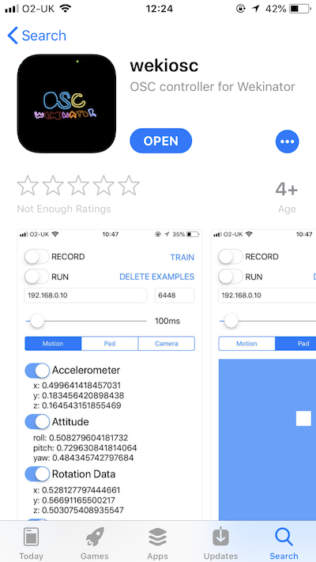
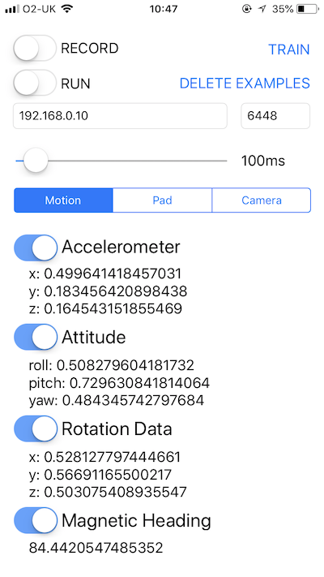
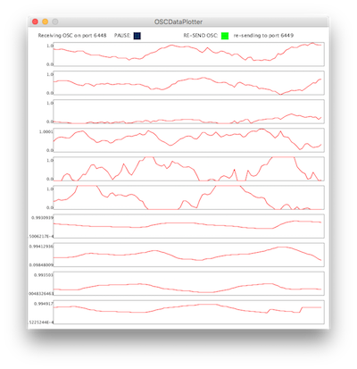

--
### 2018-04-25 
# wekiosc

I wanted to take sensor data from my iphone and send it to wekinator so that I could create music from different movements. There were other OSC apps available, but making my own allowed me to reference wekinators controls to trigger sample recording and training without needing to keep clicking on buttons on my computer.

[Repository](https://github.com/isaac-art/wekinatorControllerIOS)

---

iOS controller for use with Rebecca Fiebrink's [http://wekinator.org/](http://wekinator.org/)

Controls for recording, training, and running and deleting training examples.

Enter host ip and port in the text boxes.

MOTION TAB

-   accelerometer(x,y,z)
-   moving rotation(x,y,z)
-   attitude(roll,pitch,yaw)
-   magnetic heading as 10 seperate features.

PAD TAB

-   x position
-   y position

CAMERA TAB

-   example of 20 values from camera