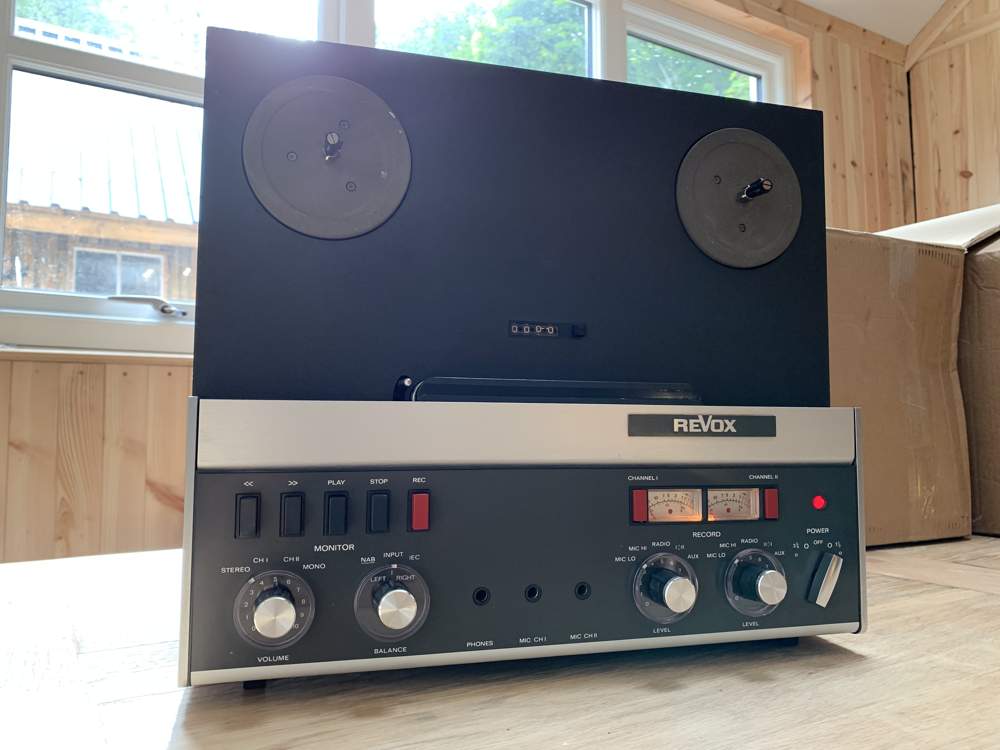
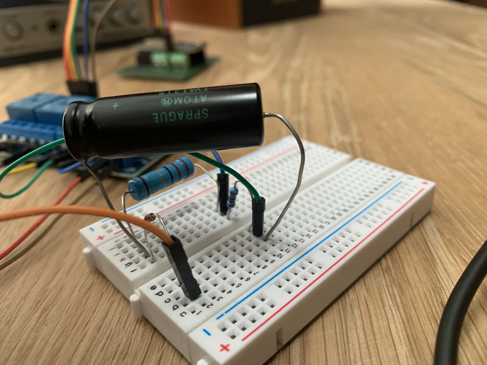
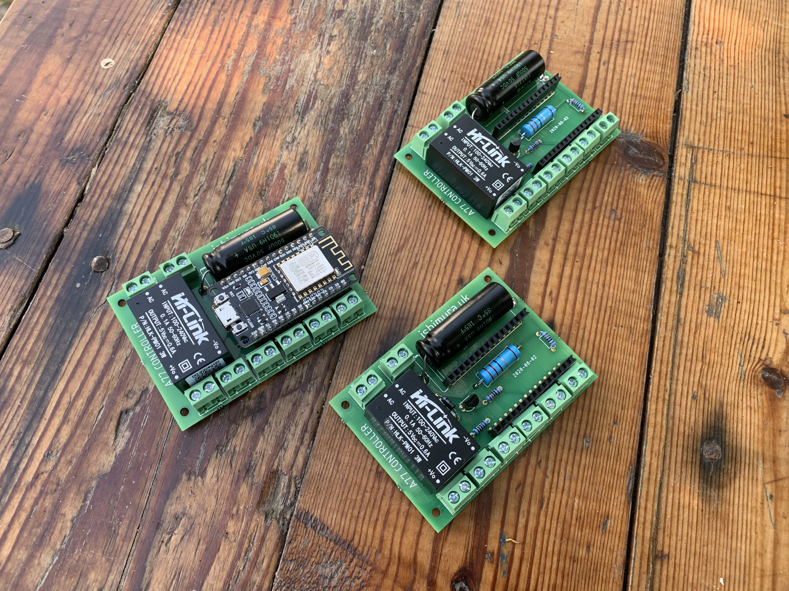
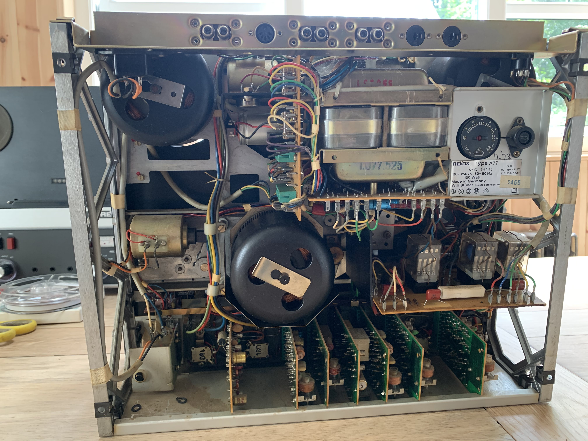
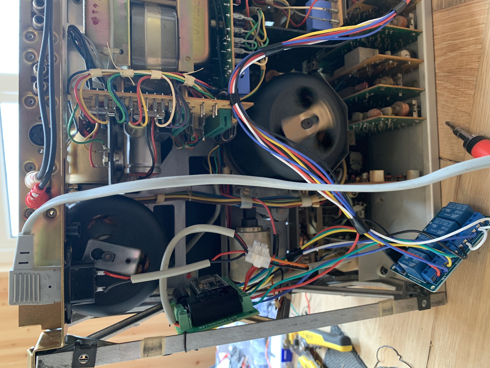
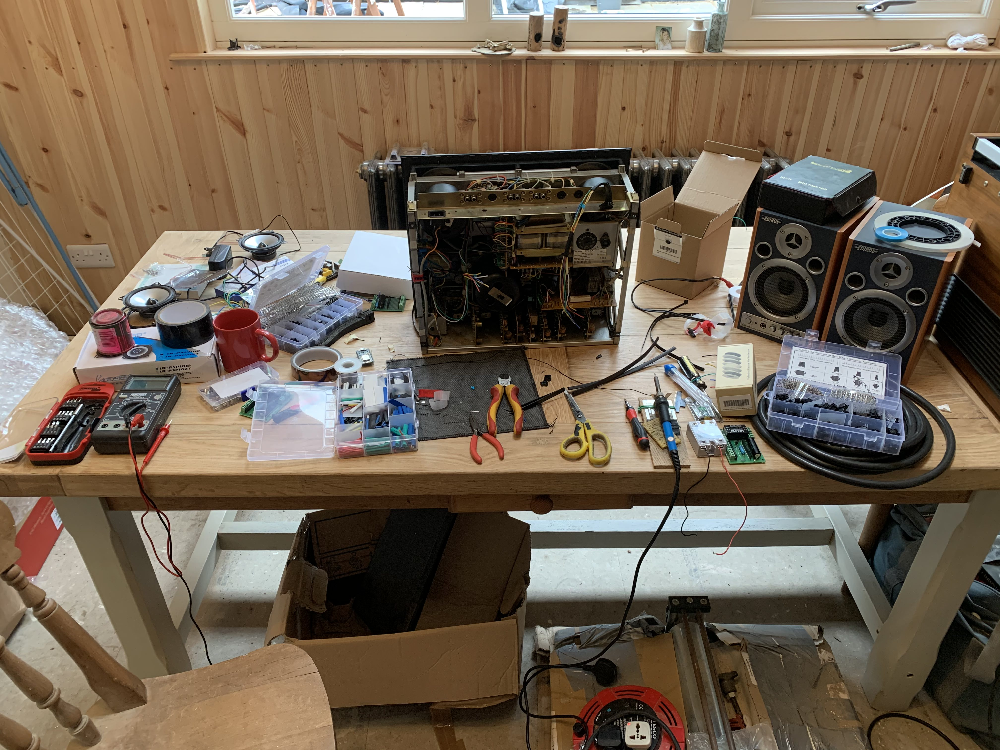

--
### 2020-08-17 
# realtoreel

I was asked to make a controller to add automatic rewinding to an old Revox A77 reel to reel tape player. 

These are great machines to work with as they had din ports for wired controllers which were used for triggering recording/playback in studios. I found the wiring for one of these controllers and used it as the base for my circuit. 

For my controller I only need the play, stop, and rewind switches. I'd decided on using an esp8266 which I could program with micropython to toggle some relays on and off, and added in the required capacitors and resistors from the original control circuit.

The idea was to rewind the tape when it reached the end of the track, then play again. So we could turn on the player and it would loop all day. The tape player had an interesting stop mechanism, a small light would shine against a photodiode with the tape running between the two, blocking the light. once the tape reached the end the light would hit the sensor and trigger the stop button. So i used this same mechanism, but instead of running the sensor to the stop button i directed it to the esp8266, then instead of letting the tape leave the spool entirely i replaced the start and end with transparent leader tape, which the light would shine thought. This way i had a signal to my controller that we had reached the end/start of the tape and that it was time to rewind/play.

After testing out the circuit worked on a breadboard I had a go at making a pcb, i hadnt done much pcb work before, there a things id definitely imporve in future such as trace widths (I just used Eagle defaults). The board had a simple task, give me somewhere to mount the large capacitor and the resistors and diodes for the control circuit, a place to mount the esp8266, and a bunch of screw terminals to connect to the relay board. I also added space for a [step down power supply module](https://smile.amazon.co.uk/gp/product/B073QH1XT8/ref=ppx_yo_dt_b_asin_title_o06_s00?ie=UTF8&psc=1) so i could tap the mains in for the tape player and use that for powering the esp8266.

I had it etched by [Aisler](https://aisler.net/). I had 3 players to control, so assembled the boards. 

These are amazing machines to take apart, everything slots together nicely, parts easy to desolder and replace, and sturdy metal framing. 

I spliced into the tape player circuit, routing the relays onto the cables for the din-controller port. 

Here is a video of the player [youtube](https://youtu.be/6oJ70X_Sa90).

And the repository with pcb and micropython scripts. [github](https://github.com/isaac-art/realToReel)

