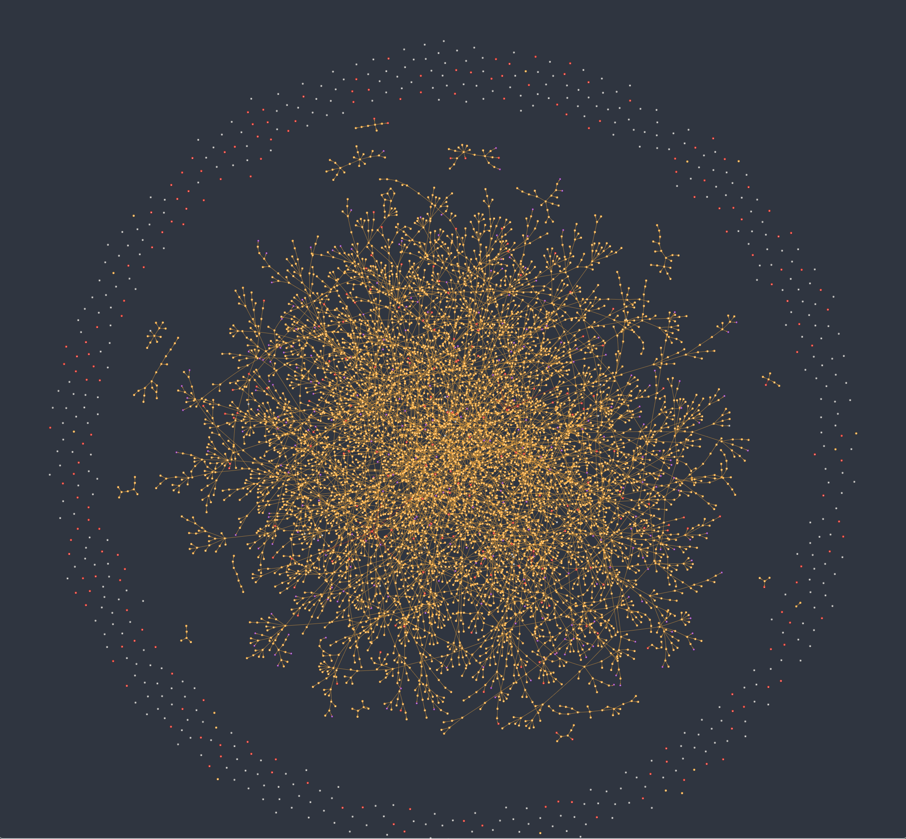
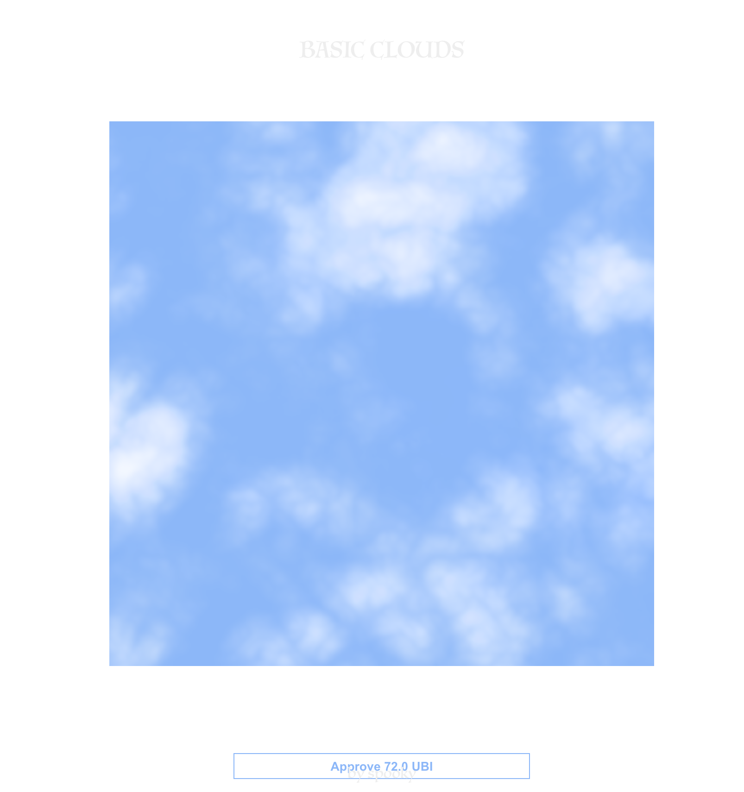

--
### 2021-03-18 
# humanity.tools

[proof of humanity](https://proofofhumanity.id/) is an interesting attempt to create a sybil resistant list of crypto signatures, so that other contracts can use it to prevent spam and other attacks in their systems.

It is also being used for a realtime UBI experiment, streaming tokens to all the registered humans. 

I wrote a few sites to play with this data, and experiment with burning UBI tokens for governance and other things. They are mostly collected on [humanity.tools](https://humanity.tools/) website.

First I made a [Graph](https://graph.humanity.tools/) showing the connections of who has vouched for who on the network. 

I then made a website which uses face encodings (positions of eyes/nose/mouth/etc) to aid in detecting duplicate entries in the registry. You give the address of the profile you are checking and it searches for similar encodings. It doesn't scale well and has a lot of false positives, but I heard that it was useful from a few people.

I then made a contract that mints generative nfts of svg clouds, but to mint them yuo have to mint an increasing number of UBI tokens. This both limits the supply to the available UBI supply, and adds a curve where the more popular it gets the more expensive it gets too. 

Now we have some artworks, we need somewhere to show them. Enter [Universal Basic Gallery](https://universal.basic.gallery/). A gallery contract, you burn UBI to choose what token is on display. By reading the contract transactions we can see the history of works that have been displayed. 

---

