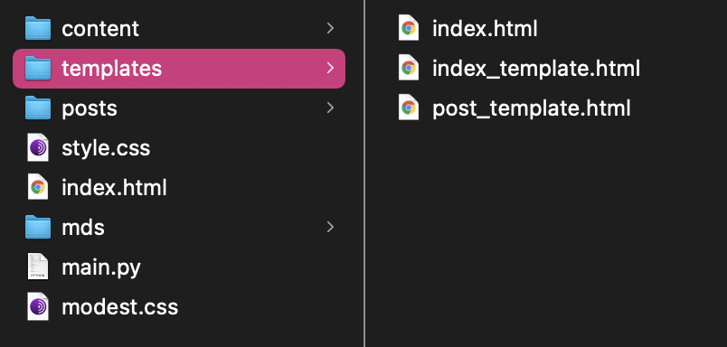

---
### 2021-01-15 
# my blog

My simple markdown to html blog script, it takes in markdown files (from mds directory) and outputs html, fitting posts to the post template (templates directory), and updates the index with the index template to include the newest post.

This blog is created with this script. I am using [Modest](https://github.com/markdowncss/modest) for the markdown styling.

---

[Repository](https://github.com/isaac-art/stone_village)

---

`python main.py`   convert all md files in mds directory to html files in posts directory

`python main.py --md="-"` remove all posts from posts directory

`python main.py --md="filename"` convert the given md file to html in posts directory

`python main.py --make="today" --name="newpost"` make an md file with the date and title for a new post
