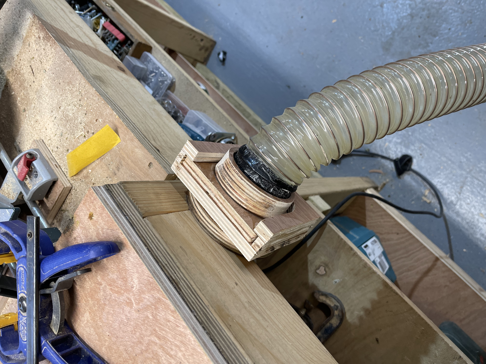

--
### 2022-01-17 
# dustextraction

We needed a quick way of attaching the vac to the different tools around the workshop.

I mocked up some quick magnetic attachments in fusion and cut them on the cnc...

.. and quickly found out the weight of the hose was too much for the magnets. So a simpler slot based version was mocked up instead.

Which worked pretty good, there is some leakage, maybe v3 can have some rubber seals.

# Rotavator Wheels

The rubber wheels on the rotavator kept popping and needing replacing on a regular basis. As we had the cnc running anyway for the vac system i cut a few 12" gear-shaped (for the traction) wheels out of 18mm ply, and screwed them together in layers of 3 to make some reaplcement wheels. Not sure how long they will hold up, but they got the job done. Maybe we can make some in metal/plastic with the same design.

